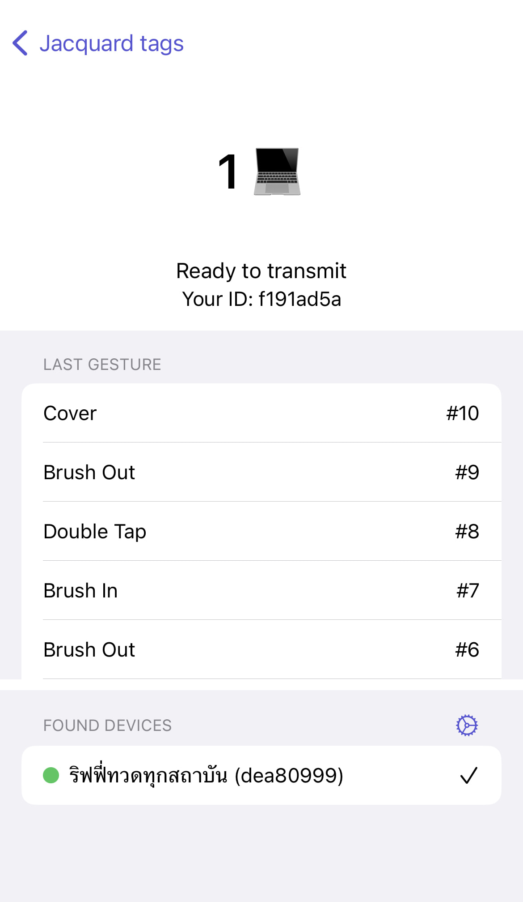

Jacquard RTC
===

Real-time communication application for Jacquard to macOS

Abstract
---

Want to use your Google Jacquard equipped jacket with your Mac? Now you can send Jacquard gesture to your Mac, and call an action to press a keystroke

For an example, you can brush in-out from your jacket to press an arrow key on your Mac in order to control your presentation.

This project is built with via [Bonjour](https://developer.apple.com/bonjour/) in mind, that means this project is communicate between iPhone, and Mac in peer-to-peer protocol. No need for centralized server!

What's included?
---

| Jacquard Transmitter | Jacquard Receiver | 
| -- | -- |
|  Requiements: **iOS 16.0+**  An iPhone application to foward gestures from Jacquard tag to your Mac  |   Requirements: **macOS 12.4+**  A macOS application to recieve Jacquard gesture, and configure keystorke to press |

How to get it?
---

Build with Xcode 14 or higher, app will not be distributed to App Store Connect so you have to build and upload running builds to your phone by yourself.

There's an *.ipa* and *.app* provided in [Release](https://github.com/rayriffy/jacquard-rtc/releases/latest) page of repository. Just in case if you want to install iOS app via AltStore but I cannot garantee that it will work.
